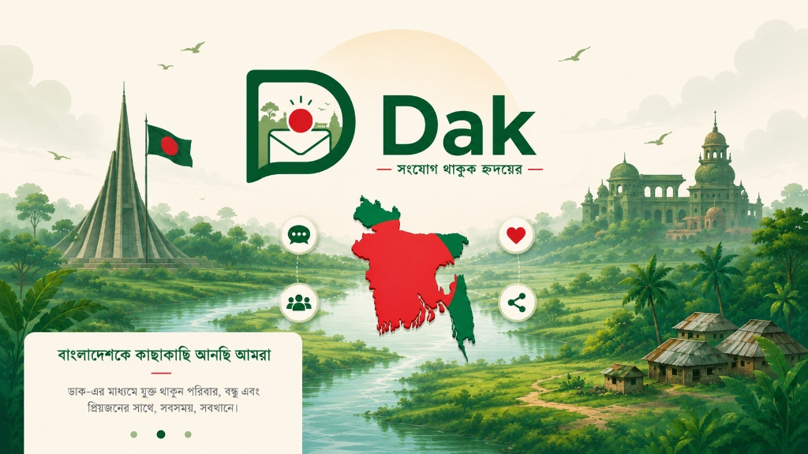
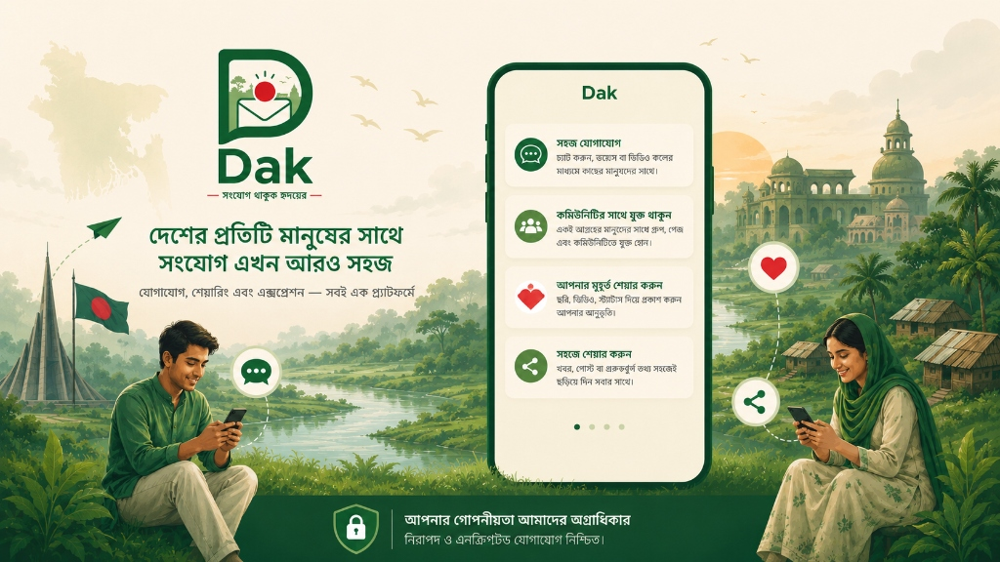

# ডাক — Dak 📬

> **সংযোগ থাকুক হৃদয়ের** — Stay Connected at Heart

<p align="center">
  
</p>

---

## 📖 প্রজেক্ট পরিচিতি (About)

**Dak** (ডাক) হলো একটি বাংলাদেশি সামাজিক যোগাযোগ অ্যাপ, যা Threads এবং Bluesky এর অনুপ্রেরণায় তৈরি করা হয়েছে। এটি মূলত বাংলাভাষী মানুষদের জন্য ডিজাইন করা হয়েছে যেখানে বাংলা ও English উভয় ভাষায় যোগাযোগ করা যায়।

**Dak** is a Bangladeshi social networking application inspired by Threads and Bluesky, built with a minimalist flat design philosophy. It is designed primarily for Bengali-speaking users with full bilingual (Bangla & English) support.

---

## ✨ মূল বৈশিষ্ট্যসমূহ (Key Features)

| বৈশিষ্ট্য | বিবরণ |
|---|---|
| 📰 **ডাক ফিড** | একটি পরিষ্কার, বিজ্ঞাপনমুক্ত unified feed |
| 🔍 **অনুসন্ধান** | ব্যবহারকারী খোঁজা ও follow করার সুবিধা |
| ➕ **ডাক পাঠান** | নতুন পোস্ট তৈরি করুন সহজেই |
| 🔔 **কার্যক্রম** | লাইক, রিপ্লাই ও ফলো নোটিফিকেশন |
| 👤 **প্রোফাইল** | ব্যক্তিগত প্রোফাইল ও পোস্ট ম্যানেজমেন্ট |
| 🌍 **বাংলাদেশ থিম** | বাংলাদেশের সংস্কৃতি ও পরিচয়ে অনুপ্রাণিত ডিজাইন |
| 🔐 **নিরাপদ লগইন** | Supabase Authentication দিয়ে সুরক্ষিত অ্যাকাউন্ট |
| 📱 **মাল্টি-প্ল্যাটফর্ম** | Android, iOS ও Web সাপোর্ট |

---

## 🖼️ স্ক্রিনশট (Screenshots)

<p align="center">
  
</p>

---

## 🏗️ টেকনোলজি স্ট্যাক (Tech Stack)

```
Framework  : Flutter (Dart)
Backend    : Supabase (PostgreSQL + Auth + Realtime)
State Mgmt : Provider
Fonts      : Google Fonts (Hind Siliguri, Outfit, Inter)
Platform   : Android · iOS · Web
```

---

## 📁 প্রজেক্ট কাঠামো (Project Structure)

```
Dak/
├── lib/
│   ├── main.dart                    # App entry point
│   ├── models/
│   │   ├── thread_post.dart         # Post/Thread model
│   │   ├── profile.dart             # User profile model
│   │   └── notification.dart        # Notification model
│   ├── screens/
│   │   ├── onboarding_screen.dart   # Onboarding slider
│   │   ├── auth_screen.dart         # Login & signup (multi-step)
│   │   ├── main_screen.dart         # Bottom nav shell
│   │   ├── feed_screen.dart         # Home feed
│   │   ├── search_explore_screen.dart # Search & discover users
│   │   ├── notifications_screen.dart  # Activity & notifications
│   │   ├── profile_screen.dart       # User profile
│   │   ├── create_thread_screen.dart # Post composer
│   │   └── edit_profile_screen.dart  # Edit profile
│   ├── services/
│   │   ├── auth_service.dart        # Auth logic + demo bypass
│   │   └── database_service.dart    # Data fetch + mock fallback
│   ├── widgets/
│   │   └── custom_thread_card.dart  # Reusable post card widget
│   └── utils/
│       └── routes.dart              # App routing
├── assets/
│   ├── logo.jpg                     # Original Dak logo
│   ├── logo_d_icon_v2.jpg           # Cropped D icon (header)
│   ├── onboarding_1.jpg             # Onboarding slide 1
│   └── onboarding_2.jpg             # Onboarding slide 2
├── android/                         # Android platform files
├── ios/                             # iOS platform files
├── web/                             # Web platform files
└── pubspec.yaml                     # Flutter dependencies
```

---

## 🚀 কিভাবে চালাবেন (Getting Started)

### প্রয়োজনীয়তা (Requirements)
- Flutter SDK >= 3.12.1
- Dart SDK >= 3.0
- Android Studio / VS Code
- Supabase account (optional — demo mode available)

### ইনস্টলেশন (Installation)

```bash
# রিপো ক্লোন করুন
git clone https://github.com/arafath306/gok.git
cd gok

# Dependencies ইনস্টল করুন
flutter pub get

# .env ফাইল তৈরি করুন (Supabase credentials)
cp .env.example .env
# SUPABASE_URL এবং SUPABASE_ANON_KEY যোগ করুন

# অ্যাপ চালু করুন
flutter run
```

### ডেমো মোড (Demo Mode)
Supabase সেটআপ ছাড়াই অ্যাপটি দেখতে:
- লগইন স্ক্রিনে **"ডেমো মোডে প্রবেশ করুন"** বাটনে ক্লিক করুন
- Mock data দিয়ে সম্পূর্ণ অ্যাপটি ব্যবহার করা যাবে

---

## 📱 স্ক্রিনসমূহ (Screens)

### 1️⃣ অনবোর্ডিং স্ক্রিন
- ২টি ফুল-স্ক্রিন ইমেজ স্লাইডার (বাম/ডান arrow দিয়ে navigate করুন)
- সাইড থেকে swipe করেও navigate করা যায়

### 2️⃣ লগইন / সাইনআপ
- মাল্টি-স্টেপ রেজিস্ট্রেশন (নাম → জন্মতারিখ → যোগাযোগ → পাসওয়ার্ড)
- Email verification সাপোর্ট

### 3️⃣ হোম ফিড
- Threads-এর মতো unified feed
- Pull-to-refresh সাপোর্ট
- Thread card এ like, reply, repost, share

### 4️⃣ সার্চ ও এক্সপ্লোর
- User search
- Follow/Unfollow toggle

### 5️⃣ নোটিফিকেশন
- Likes, replies, follows এর activity feed
- ফিল্টার chips দিয়ে filter করুন

### 6️⃣ প্রোফাইল
- নিজের threads, replies ও likes দেখুন
- Profile edit করুন

---

## 🎨 ডিজাইন নীতিমালা (Design Principles)

- **Flat & Minimalist** — কোনো gradient বা shadow নেই
- **Brand Color** — `#1E824C` (বাংলাদেশের সবুজ)
- **Typography** — Hind Siliguri (বাংলা) + Outfit & Inter (English)
- **No Auto-Animation** — সব navigation instant এবং user-controlled

---

## 🤝 অবদান (Contributing)

Pull Request এবং Issue সবসময় স্বাগত! বাংলাদেশের মানুষের জন্য তৈরি এই প্রজেক্টকে আরও ভালো করতে সহযোগিতা করুন।

---

## 📄 লাইসেন্স (License)

MIT License — স্বাধীনভাবে ব্যবহার ও পরিবর্তন করুন।

---

<p align="center">
  <strong>মেড ইন বাংলাদেশ 🇧🇩 by NGST</strong><br/>
  <em>সংযোগ থাকুক হৃদয়ের — Stay Connected at Heart</em>
</p>
